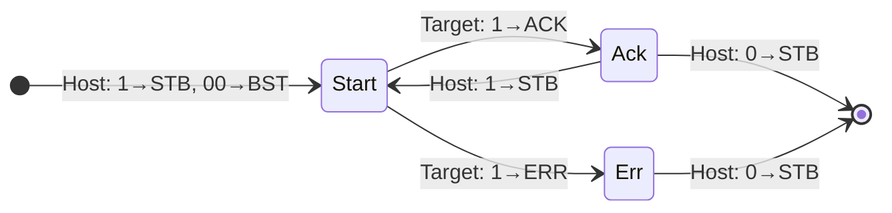
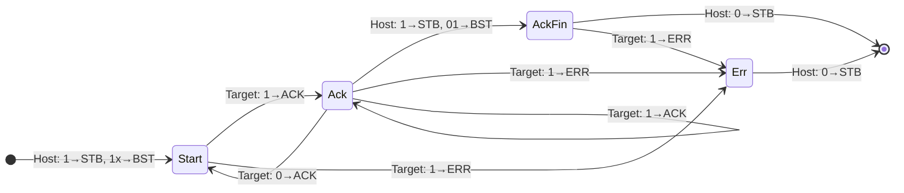

# Bus and interface
## General conventions
- For transition: valid/ready pair
- For event reporting: level state tracked on the source, W1 to clear
  - Set have higher priority than Clear 

## Bus
Basically Wishbone

### Signals
- Common System
  - `CLK`, `RSTn`: [I] for host and target
- Transition and control
  - `CYC`: [O] for host, [I] for target
    - To 1 for start of transaction, to 0 for end of transaction
    - The whole duration of `CYC` being 1 is seen as the same bus transaction
    - Used by interconnect
  - `STB`: [O] for host, [I] for target
    - 1: `WEN`, `ADR`, `DAT_h`, `SEL`, and `BST` is valid
    - Can only be 1 if `CYC` is 1
  - `WEN`: [O] for host (valid on `STB`), [I] for target
    - 1: Write, 0: Read
  - `ACK`, `ERR`: [I] for host, [O] for target
    - `ACK`=1: Transaction is complete, `DAT_t` is valid
- Address, Data, and Metadata
  - `ADR`: `[31:0]`, [O] for host (valid on `STB`), [I] for target
  - `DAT_h` and `DAT_t`: `[31:0]`
    - `DAT_h`: [I] for host, [O] for target (valid on `STB`)
    - `DAT_t`: [O] for host, [I] for target (valid on `ACK`)
  - `SEL`: `[3:0]`, [O] for host (valid on `STB`), [I] for target
    - Each bit in `SEL` corespond to 1 byte.
    - 1: Written for Write, read as normal for Read
    - 0: Not written for Write, read as 0 for Read
  - `BST`: `[1:0]`, [O] for host (valid on `STB`), [I] for target:
    - `00`: single R/W
    - `10`: burst with constant address, next address is current the same
    - `11`: burst with incrementing address, next address is current + 4
    - `01`: burst end (last transaction of a burst)
  - `QOS`: `[2:0]`, [O] for host (valid on `CYC`), [I] for target
    - Used by interconnect for arbitation priority

### Transactions

- Transctions happens when `STB & ACK == 1`

Types:
- Signle read, Single write, Read-modify-write

- Burst read, Burst write

## Target, memory mapping, and connections

- Little endian
- All targets accepts address with 0 base address
- The spaces for every targets is a power of 2
- The memory region of every targets should be able to be decoded and translated by splitting the address:
  - `full_address = {target_addr_prefix, target_local_addr}`
  - Specified by `REGION_START` and `REGION_SIZE`
    - Assertions:
      - `REGION_SIZE & (REGION_SIZE - 1) == 0`
      - `REGION_START & (REGION_SIZE - 1) == 0`
